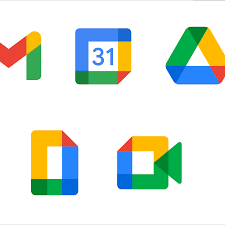

<!-- Main -->

<!-- One -->
<section id="one">
	

		<header class="major">
			<h1>Academics</h1>
		</header>

<!-- Content -->
<h2 id="content">Template</h2>

Praesent ac adipiscing ullamcorper semper ut amet ac risus. Lorem sapien ut odio odio nunc. Ac adipiscing nibh porttitor erat risus justo adipiscing adipiscing amet placerat accumsan. Vis. Faucibus odio magna tempus adipiscing a non. In mi primis arcu ut non accumsan vivamus ac blandit adipiscing adipiscing arcu metus praesent turpis eu ac lacinia nunc ac commodo gravida adipiscing eget accumsan ac nunc adipiscing adipiscing.

	

		<h3>Sem turpis amet semper</h3>
		
Nunc lacinia ante nunc ac lobortis. Interdum adipiscing gravida odio porttitor sem non mi integer non faucibus ornare mi ut ante amet placerat aliquet. Volutpat commodo eu sed ante lacinia. Sapien a lorem in integer ornare praesent commodo adipiscing arcu in massa commodo lorem accumsan at odio massa ac ac. Semper adipiscing varius montes viverra nibh in adipiscing blandit tempus accumsan.

	

	

		<h3>Magna odio tempus commodo</h3>
		
In arcu accumsan arcu adipiscing accumsan orci ac. Felis id enim aliquet. Accumsan ac integer lobortis commodo ornare aliquet accumsan erat tempus amet porttitor. Ante commodo blandit adipiscing integer semper orci eget. Faucibus commodo adipiscing mi eu nullam accumsan morbi arcu ornare odio mi adipiscing nascetur lacus ac interdum morbi accumsan vis mi accumsan ac praesent.

	

	<!-- Break -->
	

		<h3>Interdum sapien gravida</h3>
		
Nunc lacinia ante nunc ac lobortis. Interdum adipiscing gravida odio porttitor sem non mi integer non faucibus ornare mi ut ante amet placerat aliquet. Volutpat eu sed ante lacinia sapien lorem accumsan varius montes viverra nibh in adipiscing blandit tempus accumsan.

	

	

		<h3>Faucibus consequat lorem</h3>
		
Nunc lacinia ante nunc ac lobortis. Interdum adipiscing gravida odio porttitor sem non mi integer non faucibus ornare mi ut ante amet placerat aliquet. Volutpat eu sed ante lacinia sapien lorem accumsan varius montes viverra nibh in adipiscing blandit tempus accumsan.

	

	

		<h3>Accumsan montes viverra</h3>
		
Nunc lacinia ante nunc ac lobortis. Interdum adipiscing gravida odio porttitor sem non mi integer non faucibus ornare mi ut ante amet placerat aliquet. Volutpat eu sed ante lacinia sapien lorem accumsan varius montes viverra nibh in adipiscing blandit tempus accumsan.

	

<!-->

<!-----------------------------------------------Education/Schools ---------------------------------------------->
<h2 id="content">University</h2>

<!--PHOTOS FOR UNIVERSITY --->

    

        
    

    

          
    

	

		<h3>The University of Texas at Austin</h3>
		<dl>
		<b>Field of Study:</b>
		
Management Information Systems & Finance

		<b>Location:</b>
		
Austin, Texas

		</dl>
	

	

		<h3>Universitat de Barcelona</h3>
		<dl>
		<b>Field of Study:</b>
		
Business, Finance, & Liberal Arts

		<b>Location:</b>
		
Barcelona, Spain

		</dl>
	

<!-----------------------------------------------RELEVANT COURSEWORK ---------------------------------------------->
<!-- Table -->
<h3>Relevant Coursework</h3>

<h4>UT Austin Courses</h4>

	<table>
		<thead>
			<tr>
				<th>Course Name</th>
				<th>Description</th>
				<th>Skills Utilized</th>
			</tr>
		</thead>
		<tbody>
			<tr>
				<td>Web Application Development</td>
				<td>Concepts and practices of information systems. Advanced programming techniques used to generate menu-driven applications.</td>
				<td>C#, HTML, CSS, Github, Visual Studio, Lucid Chart</td>
			</tr>
			<tr>
				<td>Predictive Analytics / Data Mining</td>
				<td>Introduction to data mining problems and tools to enhance managerial decision making at all levels of the organization. Discuss scenarios, including the use of data mining to support customer relationship management (CRM) decisions, decisions in the entertainment industry, financial trading, and even professional sports teams.</td>
				<td>WEKA, Microsoft Excel</td>
			</tr>
			<tr>
				<td>Data Science for Business Applications</td>
				<td> Examine data science for business applications at the intermediate level. Explore building and validating predictive models; advanced regression modeling, including an in-depth treatment of regression; models for binary outcomes; and causal inference.</td>
				<td>R</td>
			</tr>
			<tr>
				<td>Database Management</td>
				<td>Beginning and intermediate topics in data modeling for relational database management systems.</td>
				<td>SQL, SQL Developer</td>
			</tr>
			<tr>
				<td>Introduction to Programming / Problem Solving</td>
				<td>Programming skills for creating easy-to-maintain systems for business applications. Object-oriented and structured methodologies with Python.</td>
				<td>Python, Spyder</td>
			</tr>
			<tr>
				<td>Strategic Information Technology Management</td>
				<td>Designed to develop an understanding and appreciation for the role of information technology in the context of a firm's strategy. Explores the impact of information technology on the economy and business performance, the emergence of electronic business applications and organizational and market transformation, and the nature of technology-driven business models and strategies.</td>
				<td>Microsoft PowerPoint, Roadmapping, Executive Summary</td>
			</tr>
			<tr>
				<td>Introduction to Data Science</td>
				<td>An introduction to the principles and practice of data science for business applications. Explore tidying, summarizing, and visualizing data; statistical computing in R; linear regression; introduction to predictive modeling and out-of-sample model validation. Uncertainty quantification using resampling methods. Basic probability models, including the normal and binomial distributions; and statistical hypothesis testing.</td>
				<td>R</td>
			</tr>
			<tr>
				<td>Introduction to Decision Science</td>
				<td>Examine modeling of business problems using methods from decision analysis, simulation and optimization.</td>
				<td>Macro-Enabled Microsoft Excel</td>
			</tr>
			<tr>
				<td>Operations Management</td>
				<td>The operations or production function and the skills required for analyzing and solving related problems.   </td>
				<td>Microsoft PowerPoint</td>
			</tr>
			<tr>
				<td>Golf</td>
				<td>Learned and attempted to master the game of golf.</td>
				<td>Drivers, Woods, Hybrids, Irons, Wedges, Putter</td>
			</tr>
		</tbody>
	</table>

<!-----------------------------------------------  SKILLS -------------------------------------------------------------------->
<h2 id="content">Professional Skills</h2>

	

		<h3>Computer Skills</h3>
		

			

				

				

				

				<!-- Break -->
				

				

				

				<!-- Break -->
				

				

				

				<!-- Break -->
				

				

				

			

		

		
My proficiency in various computer skills like MS Excel, PowerPoint, and Tableau allows me to effectively manipulate and analyze data, crucial for roles in data science and analysis. Additionally, expertise in tools like PowerBI and WEKA enhances my ability to derive insights from complex datasets, essential for data analysis roles. Moreover, familiarity with project management platforms like Jira and software development environments like Visual Studio makes me an asset in product management, where efficient project coordination is essential. Overall, my diverse computer skills make me a valuable employee in the tech industry, offering versatility and efficiency across product management, data science, and data analysis domains.

	

	

		<h3>Coding Skills</h3>
		

			

				

				

				

				<!-- Break -->
				

				

				

				<!-- Break -->
				

				

				

				<!-- Break -->
				

				

				

			

		

		
My proficiency spans various coding languages, including Python, SQL, JavaScript, and more, showcased through active contributions on GitHub. This skill set makes me a valuable asset in product management, where effective communication with developers is crucial. Additionally, my expertise in data science, evident in my mastery of Python and R, enables me to derive actionable insights from complex datasets, ideal for data analysis roles. Moreover, familiarity with .NET technologies like C# and .ASP.NET, combined with MVC architecture knowledge, positions me well for software development roles, where building robust applications is essential.

	

<!-- Content -->

Praesent ac adipiscing ullamcorper semper ut amet ac risus. Lorem sapien ut odio odio nunc. Ac adipiscing nibh porttitor erat risus justo adipiscing adipiscing amet placerat accumsan. Vis. Faucibus odio magna tempus adipiscing a non. In mi primis arcu ut non accumsan vivamus ac blandit adipiscing adipiscing arcu metus praesent turpis eu ac lacinia nunc ac commodo gravida adipiscing eget accumsan ac nunc adipiscing adipiscing.

	

		<h3>Sem turpis amet semper</h3>
		
Nunc lacinia ante nunc ac lobortis. Interdum adipiscing gravida odio porttitor sem non mi integer non faucibus ornare mi ut ante amet placerat aliquet. Volutpat commodo eu sed ante lacinia. Sapien a lorem in integer ornare praesent commodo adipiscing arcu in massa commodo lorem accumsan at odio massa ac ac. Semper adipiscing varius montes viverra nibh in adipiscing blandit tempus accumsan.

	

	

		<h3>Magna odio tempus commodo</h3>
		
In arcu accumsan arcu adipiscing accumsan orci ac. Felis id enim aliquet. Accumsan ac integer lobortis commodo ornare aliquet accumsan erat tempus amet porttitor. Ante commodo blandit adipiscing integer semper orci eget. Faucibus commodo adipiscing mi eu nullam accumsan morbi arcu ornare odio mi adipiscing nascetur lacus ac interdum morbi accumsan vis mi accumsan ac praesent.

	

	<!-- Break -->
	

		<h3>Interdum sapien gravida</h3>
		
Nunc lacinia ante nunc ac lobortis. Interdum adipiscing gravida odio porttitor sem non mi integer non faucibus ornare mi ut ante amet placerat aliquet. Volutpat eu sed ante lacinia sapien lorem accumsan varius montes viverra nibh in adipiscing blandit tempus accumsan.

	

	

		<h3>Faucibus consequat lorem</h3>
		
Nunc lacinia ante nunc ac lobortis. Interdum adipiscing gravida odio porttitor sem non mi integer non faucibus ornare mi ut ante amet placerat aliquet. Volutpat eu sed ante lacinia sapien lorem accumsan varius montes viverra nibh in adipiscing blandit tempus accumsan.

	

	

		<h3>Accumsan montes viverra</h3>
		
Nunc lacinia ante nunc ac lobortis. Interdum adipiscing gravida odio porttitor sem non mi integer non faucibus ornare mi ut ante amet placerat aliquet. Volutpat eu sed ante lacinia sapien lorem accumsan varius montes viverra nibh in adipiscing blandit tempus accumsan.

	

<!-- Elements -->
<h2 id="elements">Elements</h2>

	

<!-- Text stuff -->
<h3>Text</h3>

This is <b>bold</b> and this is <strong>strong</strong>. This is <i>italic</i> and this is <em>emphasized</em>.
This is superscript text and this is subscript text.
This is <u>underlined</u> and this is code: <code>for (;;) { ... }</code>.
Finally, this is a <a href="#">link</a>.

<h2>Heading Level 2</h2>
<h3>Heading Level 3</h3>
<h4>Heading Level 4</h4>

Nunc lacinia ante nunc ac lobortis. Interdum adipiscing gravida odio porttitor sem non mi integer non faucibus ornare mi ut ante amet placerat aliquet. Volutpat eu sed ante lacinia sapien lorem accumsan varius montes viverra nibh in adipiscing blandit tempus accumsan.

<!-- Lists -->
<h3>Lists</h3>

	

		<h4>Unordered</h4>
		<ul>
			<li>Dolor etiam magna etiam.</li>
			<li>Sagittis lorem eleifend.</li>
			<li>Felis dolore viverra.</li>
		</ul>

		<h4>Alternate</h4>
		<ul class="alt">
			<li>Dolor etiam magna etiam.</li>
			<li>Sagittis lorem eleifend.</li>
			<li>Felis feugiat viverra.</li>
		</ul>

	

	

		<h4>Ordered</h4>
		<ol>
			<li>Dolor etiam magna etiam.</li>
			<li>Etiam vel lorem sed viverra.</li>
			<li>Felis dolore viverra.</li>
			<li>Dolor etiam magna etiam.</li>
			<li>Etiam vel lorem sed viverra.</li>
			<li>Felis dolore viverra.</li>
		</ol>

		<h4>Icons</h4>
		<ul class="icons">
			<li><a href="#" class="icon fa-twitter">Twitter</a></li>
			<li><a href="#" class="icon fa-facebook">Facebook</a></li>
			<li><a href="#" class="icon fa-instagram">Instagram</a></li>
			<li><a href="#" class="icon fa-github">Github</a></li>
			<li><a href="#" class="icon fa-dribbble">Dribbble</a></li>
			<li><a href="#" class="icon fa-tumblr">Tumblr</a></li>
		</ul>
		<ul class="icons">
			<li><a href="#" class="icon alt fa-twitter">Twitter</a></li>
			<li><a href="#" class="icon alt fa-facebook">Facebook</a></li>
			<li><a href="#" class="icon alt fa-instagram">Instagram</a></li>
		</ul>

	

<h4>Definition</h4>
<dl>
	<dt>Item1</dt>
	<dd>
		
Lorem ipsum dolor vestibulum ante ipsum primis in faucibus vestibulum. Blandit adipiscing eu felis iaculis volutpat ac adipiscing accumsan eu faucibus. Integer ac pellentesque praesent. Lorem ipsum dolor.

	</dd>
	<dt>Item2</dt>
	<dd>
		
Lorem ipsum dolor vestibulum ante ipsum primis in faucibus vestibulum. Blandit adipiscing eu felis iaculis volutpat ac adipiscing accumsan eu faucibus. Integer ac pellentesque praesent. Lorem ipsum dolor.

	</dd>
	<dt>Item3</dt>
	<dd>
		
Lorem ipsum dolor vestibulum ante ipsum primis in faucibus vestibulum. Blandit adipiscing eu felis iaculis volutpat ac adipiscing accumsan eu faucibus. Integer ac pellentesque praesent. Lorem ipsum dolor.

	</dd>
</dl>

<h4>Actions</h4>
<ul class="actions">
	<li><a href="#" class="button special">Default</a></li>
	<li><a href="#" class="button">Default</a></li>
</ul>
<ul class="actions small">
	<li><a href="#" class="button special small">Small</a></li>
	<li><a href="#" class="button small">Small</a></li>
</ul>

	

		<ul class="actions vertical">
			<li><a href="#" class="button special">Default</a></li>
			<li><a href="#" class="button">Default</a></li>
		</ul>
	

	

		<ul class="actions vertical small">
			<li><a href="#" class="button special small">Small</a></li>
			<li><a href="#" class="button small">Small</a></li>
		</ul>
	

	

		<ul class="actions vertical">
			<li><a href="#" class="button special fit">Default</a></li>
			<li><a href="#" class="button fit">Default</a></li>
		</ul>
	

	

		<ul class="actions vertical small">
			<li><a href="#" class="button special small fit">Small</a></li>
			<li><a href="#" class="button small fit">Small</a></li>
		</ul>
	

<!-- Blockquote -->
<h3>Blockquote</h3>
<blockquote>Fringilla nisl. Donec accumsan interdum nisi, quis tincidunt felis sagittis eget tempus euismod. Vestibulum ante ipsum primis in faucibus vestibulum. Blandit adipiscing eu felis iaculis volutpat ac adipiscing accumsan faucibus. Vestibulum ante ipsum primis in faucibus vestibulum. Blandit adipiscing eu felis.</blockquote>

<!-- Table -->
<h3>Table</h3>

<h4>Default</h4>

	<table>
		<thead>
			<tr>
				<th>Name</th>
				<th>Description</th>
				<th>Price</th>
			</tr>
		</thead>
		<tbody>
			<tr>
				<td>Item1</td>
				<td>Ante turpis integer aliquet porttitor.</td>
				<td>29.99</td>
			</tr>
			<tr>
				<td>Item2</td>
				<td>Vis ac commodo adipiscing arcu aliquet.</td>
				<td>19.99</td>
			</tr>
			<tr>
				<td>Item3</td>
				<td> Morbi faucibus arcu accumsan lorem.</td>
				<td>29.99</td>
			</tr>
			<tr>
				<td>Item4</td>
				<td>Vitae integer tempus condimentum.</td>
				<td>19.99</td>
			</tr>
			<tr>
				<td>Item5</td>
				<td>Ante turpis integer aliquet porttitor.</td>
				<td>29.99</td>
			</tr>
		</tbody>
		<tfoot>
			<tr>
				<td colspan="2"></td>
				<td>100.00</td>
			</tr>
		</tfoot>
	</table>

<h4>Alternate</h4>

	<table class="alt">
		<thead>
			<tr>
				<th>Name</th>
				<th>Description</th>
				<th>Price</th>
			</tr>
		</thead>
		<tbody>
			<tr>
				<td>Item1</td>
				<td>Ante turpis integer aliquet porttitor.</td>
				<td>29.99</td>
			</tr>
			<tr>
				<td>Item2</td>
				<td>Vis ac commodo adipiscing arcu aliquet.</td>
				<td>19.99</td>
			</tr>
			<tr>
				<td>Item3</td>
				<td> Morbi faucibus arcu accumsan lorem.</td>
				<td>29.99</td>
			</tr>
			<tr>
				<td>Item4</td>
				<td>Vitae integer tempus condimentum.</td>
				<td>19.99</td>
			</tr>
			<tr>
				<td>Item5</td>
				<td>Ante turpis integer aliquet porttitor.</td>
				<td>29.99</td>
			</tr>
		</tbody>
		<tfoot>
			<tr>
				<td colspan="2"></td>
				<td>100.00</td>
			</tr>
		</tfoot>
	</table>

<!-- Buttons -->
<h3>Buttons</h3>
<ul class="actions">
	<li><a href="#" class="button special">Special</a></li>
	<li><a href="#" class="button">Default</a></li>
</ul>
<ul class="actions">
	<li><a href="#" class="button big">Big</a></li>
	<li><a href="#" class="button">Default</a></li>
	<li><a href="#" class="button small">Small</a></li>
</ul>
<ul class="actions">
	<li><a href="#" class="button special big">Big</a></li>
	<li><a href="#" class="button special">Default</a></li>
	<li><a href="#" class="button special small">Small</a></li>
</ul>
<ul class="actions fit">
	<li><a href="#" class="button special fit">Fit</a></li>
	<li><a href="#" class="button fit">Fit</a></li>
</ul>
<ul class="actions fit small">
	<li><a href="#" class="button special fit small">Fit + Small</a></li>
	<li><a href="#" class="button fit small">Fit + Small</a></li>
</ul>
<ul class="actions">
	<li><a href="#" class="button special icon fa-search">Icon</a></li>
	<li><a href="#" class="button icon fa-download">Icon</a></li>
</ul>
<ul class="actions">
	<li>Special</li>
	<li>Default</li>
</ul>

<!-- Form -->
<h3>Form</h3>

<form method="post" action="#">
	

		

			<input type="text" name="demo-name" id="demo-name" value="" placeholder="Name" />
		

		

			<input type="email" name="demo-email" id="demo-email" value="" placeholder="Email" />
		

		<!-- Break -->
		

			

				<select name="demo-category" id="demo-category">
					<option value="">- Category -</option>
					<option value="1">Manufacturing</option>
					<option value="1">Shipping</option>
					<option value="1">Administration</option>
					<option value="1">Human Resources</option>
				</select>
			

		

		<!-- Break -->
		

			<input type="radio" id="demo-priority-low" name="demo-priority" checked>
			<label for="demo-priority-low">Low</label>
		

		

			<input type="radio" id="demo-priority-normal" name="demo-priority">
			<label for="demo-priority-normal">Normal</label>
		

		

			<input type="radio" id="demo-priority-high" name="demo-priority">
			<label for="demo-priority-high">High</label>
		

		<!-- Break -->
		

			<input type="checkbox" id="demo-copy" name="demo-copy">
			<label for="demo-copy">Email me a copy</label>
		

		

			<input type="checkbox" id="demo-human" name="demo-human" checked>
			<label for="demo-human">I am a human</label>
		

		<!-- Break -->
		

			<textarea name="demo-message" id="demo-message" placeholder="Enter your message" rows="6"></textarea>
		

		<!-- Break -->
		

			<ul class="actions">
				<li><input type="submit" value="Send Message" class="special" /></li>
				<li><input type="reset" value="Reset" /></li>
			</ul>
		

	

</form>

<!-- Image -->
<h3>Image</h3>

<h4>Fit</h4>

	

		

		

		

		<!-- Break -->
		

		

		

		<!-- Break -->
		

		

		

	

<h4>Left &amp; Right</h4>

Lorem ipsum dolor sit accumsan interdum nisi, quis tincidunt felis sagittis eget. tempus euismod. Vestibulum ante ipsum primis in faucibus vestibulum. Blandit adipiscing eu felis iaculis volutpat ac adipiscing accumsan eu faucibus. Integer ac pellentesque praesent tincidunt felis sagittis eget. tempus euismod. Vestibulum ante ipsum primis sagittis eget. tempus euismod. Vestibulum ante ipsum primis in faucibus vestibulum. Blandit adipiscing eu felis iaculis volutpat ac adipiscing accumsan eu faucibus. Integer ac pellentesque praesent tincidunt felis sagittis eget tempus vestibulum ante ipsum primis in faucibus magna blandit adipiscing eu felis iaculis.

Lorem ipsum dolor sit accumsan interdum nisi, quis tincidunt felis sagittis eget. tempus euismod. Vestibulum ante ipsum primis in faucibus vestibulum. Blandit adipiscing eu felis iaculis volutpat ac adipiscing accumsan eu faucibus. Integer ac pellentesque praesent tincidunt felis sagittis eget. tempus euismod. Vestibulum ante ipsum primis sagittis eget. tempus euismod. Vestibulum ante ipsum primis in faucibus vestibulum. Blandit adipiscing eu felis iaculis volutpat ac adipiscing accumsan eu faucibus. Integer ac pellentesque praesent tincidunt felis sagittis eget tempus vestibulum ante ipsum primis in faucibus magna blandit adipiscing eu felis iaculis.

<!-- Box -->
<h3>Box</h3>

	
Felis sagittis eget tempus primis in faucibus vestibulum. Blandit adipiscing eu felis iaculis volutpat ac adipiscing accumsan eu faucibus. Integer ac pellentesque praesent tincidunt felis sagittis eget. tempus euismod. Magna sed etiam ante ipsum primis in faucibus vestibulum. Blandit adipiscing eu ipsum primis in faucibus vestibulum. Blandit adipiscing eu felis iaculis volutpat ac adipiscing accumsan eu faucibus lorem ipsum.

<!-- Preformatted Code -->
<h3>Preformatted</h3>
<pre><code>i = 0;

while (!deck.isInOrder()) {
    print 'Iteration ' + i;
    deck.shuffle();
    i++;
}

print 'It took ' + i + ' iterations to sort the deck.';
</code></pre>

</section>

