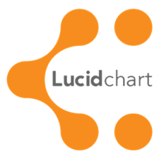
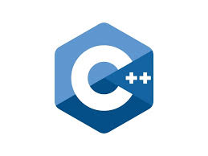

<!-- Main -->

<!-- One -->
<section id="one">
	

		<header class="major">
		</header>

<!-----------------------------------------------Education/Schools ---------------------------------------------->
<h2 id="content">University</h2>

<html lang="en">
<head>
    <meta charset="UTF-8">
    <meta name="viewport" content="width=device-width, initial-scale=1.0">
    <title>University Information</title>
    
</head>
<body>
    

        

            

                
            

            <h3>The University of Texas at Austin</h3>
            

                <dt>Field of Study:</dt>
                <dd>Management Information Systems & Finance</dd>
            

            

                <dt class="location">Location:</dt>
                <dd class="location">Austin, Texas</dd>
            

        

        

            

                
            

            <h3>Universitat de Barcelona</h3>
            

                <dt>Field of Study:</dt>
                <dd>Business, Finance, & Liberal Arts</dd>
            

            

                <dt class="location">Location:</dt>
                <dd class="location">Barcelona, Spain</dd>
            

        

    

</body>
</html>

<!-----------------------------------------------RELEVANT COURSEWORK ---------------------------------------------->
<!-- Table -->
<header class="major">
	<h1>Relevant Coursework</h1>
</header>

<h2>UT Austin Courses</h2>

	<table>
		<thead>
			<tr>
				<th>Course Name</th>
				<th>Description</th>
				<th>Skills Utilized</th>
			</tr>
		</thead>
		<tbody>
			<tr>
				<td>Web Application Development</td>
				<td>Concepts and practices of information systems. Advanced programming techniques used to generate menu-driven applications.</td>
				<td>C#, HTML, CSS, Github, Visual Studio, Lucid Chart</td>
			</tr>
			<tr>
				<td>Predictive Analytics / Data Mining</td>
				<td>Introduction to data mining problems and tools to enhance managerial decision making at all levels of the organization. Discuss scenarios, including the use of data mining to support customer relationship management (CRM) decisions, decisions in the entertainment industry, financial trading, and even professional sports teams.</td>
				<td>WEKA, Microsoft Excel</td>
			</tr>
			<tr>
				<td>Data Science for Business Applications</td>
				<td> Examine data science for business applications at the intermediate level. Explore building and validating predictive models; advanced regression modeling, including an in-depth treatment of regression; models for binary outcomes; and causal inference.</td>
				<td>R</td>
			</tr>
			<tr>
				<td>Database Management</td>
				<td>Beginning and intermediate topics in data modeling for relational database management systems.</td>
				<td>SQL, SQL Developer</td>
			</tr>
			<tr>
				<td>Introduction to Programming / Problem Solving</td>
				<td>Programming skills for creating easy-to-maintain systems for business applications. Object-oriented and structured methodologies with Python.</td>
				<td>Python, Spyder</td>
			</tr>
			<tr>
				<td>Strategic Information Technology Management</td>
				<td>Designed to develop an understanding and appreciation for the role of information technology in the context of a firm's strategy. Explores the impact of information technology on the economy and business performance, the emergence of electronic business applications and organizational and market transformation, and the nature of technology-driven business models and strategies.</td>
				<td>Microsoft PowerPoint, Roadmapping, Executive Summary</td>
			</tr>
			<tr>
				<td>Introduction to Data Science</td>
				<td>An introduction to the principles and practice of data science for business applications. Explore tidying, summarizing, and visualizing data; statistical computing in R; linear regression; introduction to predictive modeling and out-of-sample model validation. Uncertainty quantification using resampling methods. Basic probability models, including the normal and binomial distributions; and statistical hypothesis testing.</td>
				<td>R</td>
			</tr>
			<tr>
				<td>Introduction to Decision Science</td>
				<td>Examine modeling of business problems using methods from decision analysis, simulation and optimization.</td>
				<td>Macro-Enabled Microsoft Excel</td>
			</tr>
			<tr>
				<td>Operations Management</td>
				<td>The operations or production function and the skills required for analyzing and solving related problems.   </td>
				<td>Microsoft PowerPoint</td>
			</tr>
			<tr>
				<td>Golf</td>
				<td>Learned and attempted to master the game of golf.</td>
				<td>Drivers, Woods, Hybrids, Irons, Wedges, Putter</td>
			</tr>
		</tbody>
	</table>

<!-----------------------------------------------  SKILLS -------------------------------------------------------------------->
		<header class="major">
			<h1>Professional Skills</h1>
		</header>

	

		<h2>Computer Skills</h2>
		

			

				

				

				

				<!-- Break -->
				

				

				

				<!-- Break -->
				

				

				

				<!-- Break -->
				

				

				

			

		

		
My proficiency in various computer skills like MS Excel, PowerPoint, and Tableau allows me to effectively manipulate and analyze data, crucial for roles in data science and analysis. Additionally, expertise in tools like PowerBI and WEKA enhances my ability to derive insights from complex datasets, essential for data analysis roles. Moreover, familiarity with project management platforms like Jira and software development environments like Visual Studio makes me an asset in product management, where efficient project coordination is essential. Overall, my diverse computer skills make me a valuable employee in the tech industry, offering versatility and efficiency across product management, data science, and data analysis domains.

	

	

		<h2>Coding Skills</h2>
		

			

				

				

				

				<!-- Break -->
				

				

				

				<!-- Break -->
				

				

				

				<!-- Break -->
				

				

				

			

		

		
My proficiency spans various coding languages, including Python, SQL, JavaScript, and more, showcased through active contributions on GitHub. This skill set makes me a valuable asset in product management, where effective communication with developers is crucial. Additionally, my expertise in data science, evident in my mastery of Python and R, enables me to derive actionable insights from complex datasets, ideal for data analysis roles. Moreover, familiarity with .NET technologies like C# and .ASP.NET, combined with MVC architecture knowledge, positions me well for software development roles, where building robust applications is essential.

	

<!-------------------------------------------Certifications -------------------------------------------------------------------->
<header class="major">
			<h1>Certifications</h1>
		</header>
<dl>
	<dt><h2>Introduction to Data Science</h2></dt>
	<dd>
		
The world of data science is reshaping every business, regardless of industry, location, or role. And there’s never been a better time to get up to speed and learn the basics of this booming field. In this course, designed specifically for beginners, explore the world of data science, its opportunities and innovations, and the fundamental skills required for success. Join Python trainer and data science expert Lavanya Vijayan as she shares what data science is and how it differs from other common data-related careers. Discover some of the most important tools used in the trade to develop your understanding of data libraries and data manipulation. Along the way, get an introduction to exploratory data analysis, data cleaning, data visualization, sampling, testing, estimating, and more. By the end of this course, you’ll know how to use inference and statistical analysis to make more reliable predictions for your business.

	</dd>
	

        <!-- Use this button to press to access the photo of the certification -->
        <a href="https://drive.google.com/file/d/1v3CmF7aiFocsksG1tWoz15GlEvN2oemU/view?usp=sharing" class="button small special">Certification</a>
        <!-- Use this button to press to access the notes -->
        <a href="https://drive.google.com/file/d/1Zgk9TdlLO6FnMWvtUrh3HIb88hTWkQJq/view?usp=sharing" class="button small">Notes</a>
    

	<h2></h2>	
	<dt><h2>The Non-Technical Skills of Effective Data Scientists</h2></dt>
	<dd>
		
Most data science training focuses only on key technologies. But real-world data science jobs require more than just technical acumen. When new data scientists change their focus from the classroom to the boardroom, they must be able to empathize, persuade, and lead others if they want to successfully run projects that produce business transformation. This course was designed to help you learn these, and other, nontechnical skills that can help you convert your first data science job into a successful, lifelong career. There are predictable challenges to be overcome when predictive models introduce change in organizations. Throughout this course, instructor Keith McCormick goes over these challenges and shows how to overcome them. Discover how to confidently defend your turf at work, enhance your own natural curiosity, deepen your commitment to your craft, effectively translate the language of analytics to the language of business, practice diplomacy, and more.

	</dd>
	

        <!-- Use this button to press to access the photo of the certification -->
        <a href="https://drive.google.com/file/d/1CsIrBqidIuGJRuAmTg2wO448_AwUi53R/view?usp=sharing" class="button small special">Certification</a>
        <!-- Use this button to press to access the notes -->
        <a href="https://drive.google.com/file/d/1AwBisAnmUws5ik0fz-DomnMSsQix17gy/view?usp=sharing" class="button small">Notes</a>
    

	<h2></h2>
	<dt><h2>Data-Driven Product Management</h2></dt>
	<dd>
		
In this course with product strategist Drew Falkman, learn the difference between product and marketing analytics, and why product analytics and the insight they provide are critical to making important product decisions. Drew reviews popular product analytics software tools—including AI solutions—and introduces you to the main tools and processes product managers use to analyze product data. Learn how to maintain a data-driven strategy, recognize key product analytics to measure, how to make data-driven business cases, and explore some advanced analytics considerations for product managers and their organizations. Learning objectives: 1. Discover best practices for using metrics to drive key product decisions.2. Learn how to establish and maintain a data-driven product strategy.3. Recognize key product analytics to measure, and the insight they provide.4. Learn how to make data-driven business cases.5. Learn how to experiment with the data insights you're gathering to improve product/market fit and performance.6. Explore advanced analytics considerations for product managers and their organizations.

	</dd>
	

        <!-- Use this button to press to access the photo of the certification -->
        <a href="https://drive.google.com/file/d/19dEuIgmNI_ZZVfrLB6Ls1kktmd0UzzRf/view?usp=sharing" class="button small special">Certification</a>
        <!-- Use this button to press to access the notes -->
        <a href="https://drive.google.com/file/d/1QTT0mVz-WrBj_7e4aFmMSqhftiZMLUD4/view?usp=sharing" class="button small">Notes</a>
    

	<h2></h2>
	<dt><h2>Product Strategy Micro-Certification</h2></dt>
	<dd>
		
A Product Strategy is a comprehensive plan that delineates a company's objectives and methods for attaining them through its product offerings, integrating the Product Vision and the Company Vision/Mission/Goals. It encompasses elements such as Product Vision, Insights, Challenges, Approaches, and Accountability, providing direction, aligning business strategy, meeting customer needs, differentiating from competitors, and optimizing resources. Crafting an effective Product Strategy involves six key steps: Market analysis, Customer analytics, Product vision and mission, Objectives and key results (OKRs), Product roadmap, and Prioritization, with an emphasis on incorporating long-term goals into daily operations, aligning resources, and outlining ownership. Effective communication of the Product Strategy to stakeholders is vital, necessitating clear messaging, tailored communication, and engagement through two-way communication and data utilization. Attributes of a successful Product Strategy include clarity in vision and mission, customer-centricity, market orientation, prioritized initiatives, measurable goals, data-driven decision-making, innovation, flexibility, resource alignment, and effective communication.

	</dd>
	

        <!-- Use this button to press to access the photo of the certification -->
        <a href="https://drive.google.com/file/d/1Vz6a1MPhieIsO5DR8ePPRjCP7qLm8tlt/view?usp=sharing" class="button small special">Certification</a>
        <!-- Use this button to press to access the notes -->
        <a href="https://drive.google.com/file/d/1pn4eq1_1EQCVIfC7vXlDlHKMGBeFZg4j/view?usp=sharing" class="button small">Notes</a>
    

	<h2></h2>
</dl>

<!-------------------------------------------Awards/ Comps -------------------------------------------------------------------->

<header class="major">
			<h1>Awards</h1>
		</header>

	<h3>MIS 333K Web Application Development: 3rd place / 26 teams (104 studnets)</h3>
	<h4>Spring 2024 (Janurary - April)</h4>
	
In a highly competitive project, our team secured 3rd place out of 24 groups, consisting of about 96 students, by developing a comprehensive airline reservation system. Utilizing tools like Visual Studio, Lucidchart for business flow and ERD, and Microsoft Azure for database connections, we linked database querying using SQL. I led a team of four as the project manager in an agile format, organizing tasks through two stand-up meetings per sprint and conducting structured working sessions to achieve at least four coding tasks each. Our project included creating three Razor views for business logic, designing three business flow diagrams, and drafting UI images for the website's appearance. We compiled a product portfolio backlog and roadmap, conducted competitive analysis, and researched customer needs and the digital marketing landscape. We wrote 100 test cases for A/B testing, ensuring a robust iterative process. Our efforts culminated in a successful working website, presented to our professor for evaluation, which ultimately led to our top-tier placement. As a team, we managed the roles of Design, Engineering, and Research/Analytics, bringing the product from ideation to launch.

	<a href="assets/images/333KAward/FinalGroupProject.zip" class="button icon fa-download" download>Project Code (VS)</a>
	<a href="assets/images/333KAward/MIS 333K Final Project Process Flow - Page 1.pdf" class="button icon fa-download" download>Process Flow Diagram</a>

	<h3>McCombs Fall Case Competition: 9th place / 18 teams</h3>
	<h4>Fall 2021 (September - October)</h4>
	
In a case competition centered around the integration and creation of a mental health app, I led a team of four using an agile format, organizing tasks and stand-up meetings via a Kanban board on Atlassian. I conducted a comprehensive market analysis, including survey research and examining data from similar apps, to forecast potential future users. Our two-part solution was developed using Microsoft PowerPoint and Lucidchart, ensuring clear and professional presentations. I designed a template interface with Adobe and Canva to provide a visual representation of our app. Additionally, I created a competitive analysis chart and a financial model for the app's free, freemium, and fully paid versions using Excel. This model included evaluations of EBITDA, terminal growth rate, enterprise value, and revenue per user forecasts. Our thorough preparation culminated in a presentation to a panel of ten judges. Our strategic use of tools and data analysis highlighted the app's potential impact and market viability. The project not only showcased our technical and analytical skills but also demonstrated our ability to deliver a comprehensive business proposal in a competitive setting.

	<a href="https://drive.google.com/file/d/1i1SYadbeVscmB99l6h3p5GrFl8mTiPhs/view?usp=sharing" class="button">Slide Deck</a>

<!-------------------------------------------END -------------------------------------------------------------------->

<!-- Content -->

Praesent ac adipiscing ullamcorper semper ut amet ac risus. Lorem sapien ut odio odio nunc. Ac adipiscing nibh porttitor erat risus justo adipiscing adipiscing amet placerat accumsan. Vis. Faucibus odio magna tempus adipiscing a non. In mi primis arcu ut non accumsan vivamus ac blandit adipiscing adipiscing arcu metus praesent turpis eu ac lacinia nunc ac commodo gravida adipiscing eget accumsan ac nunc adipiscing adipiscing.

	

		<h3>Sem turpis amet semper</h3>
		
Nunc lacinia ante nunc ac lobortis. Interdum adipiscing gravida odio porttitor sem non mi integer non faucibus ornare mi ut ante amet placerat aliquet. Volutpat commodo eu sed ante lacinia. Sapien a lorem in integer ornare praesent commodo adipiscing arcu in massa commodo lorem accumsan at odio massa ac ac. Semper adipiscing varius montes viverra nibh in adipiscing blandit tempus accumsan.

	

	

		<h3>Magna odio tempus commodo</h3>
		
In arcu accumsan arcu adipiscing accumsan orci ac. Felis id enim aliquet. Accumsan ac integer lobortis commodo ornare aliquet accumsan erat tempus amet porttitor. Ante commodo blandit adipiscing integer semper orci eget. Faucibus commodo adipiscing mi eu nullam accumsan morbi arcu ornare odio mi adipiscing nascetur lacus ac interdum morbi accumsan vis mi accumsan ac praesent.

	

	<!-- Break -->
	

		<h3>Interdum sapien gravida</h3>
		
Nunc lacinia ante nunc ac lobortis. Interdum adipiscing gravida odio porttitor sem non mi integer non faucibus ornare mi ut ante amet placerat aliquet. Volutpat eu sed ante lacinia sapien lorem accumsan varius montes viverra nibh in adipiscing blandit tempus accumsan.

	

	

		<h3>Faucibus consequat lorem</h3>
		
Nunc lacinia ante nunc ac lobortis. Interdum adipiscing gravida odio porttitor sem non mi integer non faucibus ornare mi ut ante amet placerat aliquet. Volutpat eu sed ante lacinia sapien lorem accumsan varius montes viverra nibh in adipiscing blandit tempus accumsan.

	

	

		<h3>Accumsan montes viverra</h3>
		
Nunc lacinia ante nunc ac lobortis. Interdum adipiscing gravida odio porttitor sem non mi integer non faucibus ornare mi ut ante amet placerat aliquet. Volutpat eu sed ante lacinia sapien lorem accumsan varius montes viverra nibh in adipiscing blandit tempus accumsan.

	

