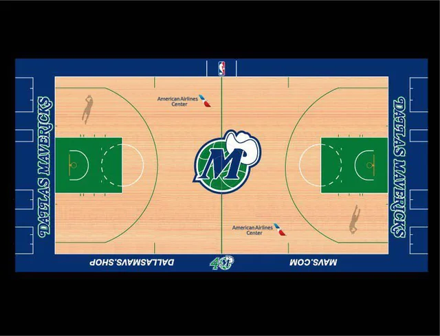

<!-- Main -->

<!-- One -->
<section id="one">
	

		<header class="major">
			<h2>Background on the projects</h2>
		</header>
		
A look into all of the predictive ananlytic projects I have worked on through Google Collab. You have access to the code and a summary report. These projects are passion projects I had to help me not only reinforce my knowledge working with machine learning algorithms and artificial intelligence but also understand how these concepts can apply in real life and to my interests. I learned to code these projects through a plethora of hours in school, YouTube, certificates, and google searches.

	

</section>

<!-- Two -->
<section id="two" class="spotlights">
<head>
    <meta charset="UTF-8">
    <meta name="viewport" content="width=device-width, initial-scale=1.0">
    <title>Wine Quality Prediction</title>
    
</head>
<body>
    <section class="flex-container">
        
        

            

                <header class="major">
                    <h3>Wine Quality Prediction</h3>
                </header>
                
This project focuses on developing a machine learning pipeline to predict the quality of red wine based on its chemical properties. By leveraging a dataset of red wine samples, the pipeline involves data loading, exploratory data analysis, feature engineering, model training, and evaluation. Key steps include visualizing relationships between wine quality and various chemical attributes, applying polynomial feature transformation to capture non-linear interactions, and using a Random Forest classifier optimized through grid search for hyperparameter tuning. The model's performance is evaluated on a test set, demonstrating its ability to accurately classify wine quality as good or bad. This project showcases an effective and systematic approach to predictive modeling, providing valuable insights and accurate predictions in the context of wine quality assessment.

                <ul class="actions">
                    <li></li>
					<li><a href="https://drive.google.com/file/d/1qo4NzSePGE8Uda5ia-uWtoYJRNhiGgvF/view?usp=sharing" class="button">Summary Report</a></li>
					<li><a href="CollabProjects/Projects/Wine Prediction/winequality-red.csv" class="button special icon fa-download" download>Wine csv file</a></li>
                </ul>
            

        

    </section>
	<section>
		
		

			

				<header class="major">
					<h3>Car Price Prediction</h3>
				</header>
				
This project focuses on developing a sophisticated car price prediction model using machine learning techniques. By analyzing historical car sales data, the model predicts the selling prices of cars based on various features such as fuel type, seller type, and transmission. Advanced methods like polynomial feature generation, hyperparameter tuning, and cross-validation are employed to enhance the model's accuracy and robustness. The project aims to empower buyers and sellers in the automotive market with data-driven insights for making informed pricing decisions. Overall, it provides a valuable tool for setting competitive prices and understanding the factors influencing car prices.

				<ul class="actions">
                    <li></li>
					<li><a href="https://drive.google.com/file/d/19iw73eMmS1OBY2cUNLxd2feBxyd8T6UF/view?usp=sharing" class="button">Summary Report</a></li>
					<li><a href="CollabProjects/Projects/Car Price Prediction/car data.csv" class="button special icon fa-download" download>Car csv file</a></li>
                </ul>
			

		

	</section>
	<section>
		
		

			

				<header class="major">
					<h3>NBA Salary Predictor</h3>
				</header>
				
Nullam et orci eu lorem consequat tincidunt vivamus et sagittis magna sed nunc rhoncus condimentum sem. In efficitur ligula tate urna. Maecenas massa sed magna lacinia magna pellentesque lorem ipsum dolor. Nullam et orci eu lorem consequat tincidunt. Vivamus et sagittis tempus.

				<ul class="actions">
                    <li></li>
					<li><a href="https://drive.google.com/file/d/1SKbRthkUK6QK_Qt5or9qmHzjpJRW2Akm/view?usp=sharing" class="button">Summary Report</a></li>
					<li><a href="CollabProjects/Projects/NBA Salaries/nba_2022-23_all_stats_with_salary.csv" class="button special icon fa-download" download>Car csv file</a></li>
                </ul>
			

		

	</section>
</body>
</section>
